# Android AntennaPod UI 参考截图

> 从录屏 `Screen_recording_20260317_190113.webm` 提取，共 21 张去重截图。
> 底部导航栏固定 5 个 Tab：Home / Queue / Inbox / Subscriptions / More。
> 所有页面底部都有迷你播放器栏（显示当前播放的节目）。

---

## 1. Home 首页

### 1.1 Home 页（顶部）
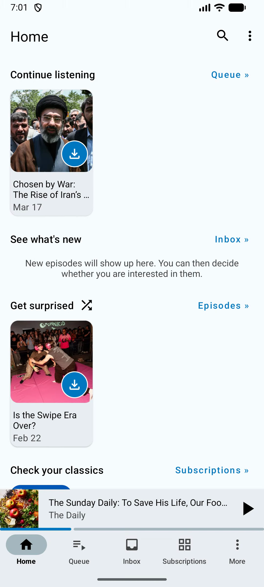
- 标题 "Home"，右上角搜索图标 + 三点菜单
- 分区卡片式布局：
  - **Continue listening** — 上次收听的节目，右侧 "Queue >" 链接
  - **See what's new** — 新剧集提示，右侧 "Inbox >" 链接
  - **Get surprised** — 随机推荐，右侧 "Episodes >" 链接
  - **Check your classics** — 经典订阅，右侧 "Subscriptions >" 链接
- 每个分区的节目卡片包含：封面图、标题、日期、下载按钮

### 1.2 Home 页（滚动后）
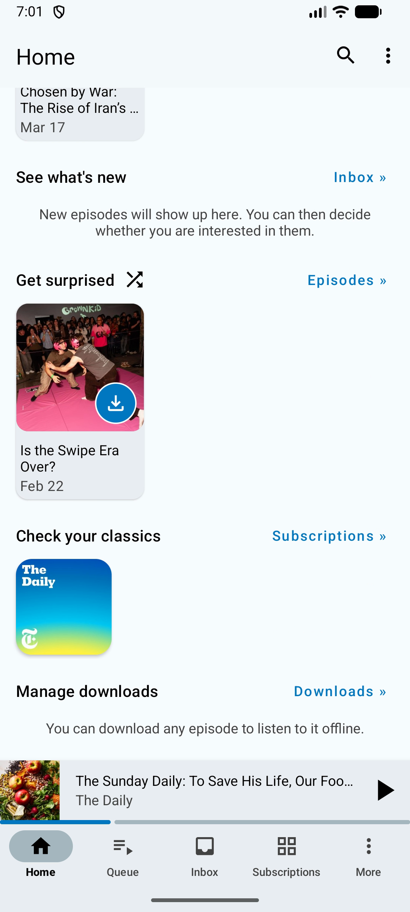
- 继续展示更多分区：
  - **Check your classics** — 显示订阅封面缩略图
  - **Manage downloads** — 下载管理入口，右侧 "Downloads >" 链接
  - 提示文字："You can download any episode to listen to it offline."

### 1.3 Home 页 — 溢出菜单
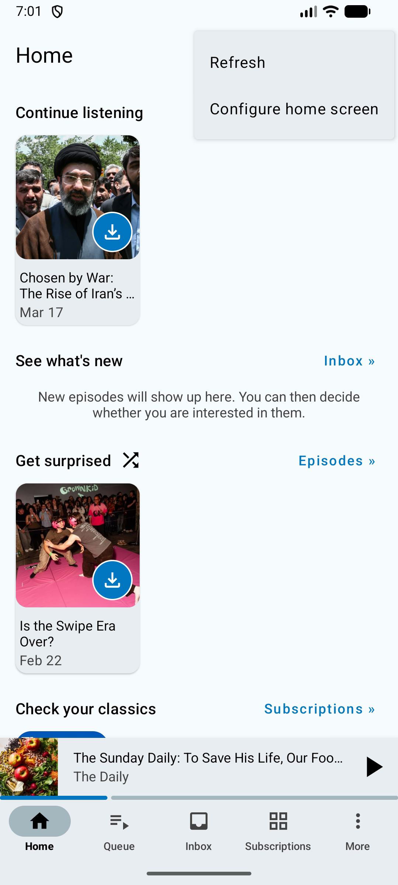
- 菜单项：Refresh / Configure home screen

### 1.4 Home 页 — 配置首页弹窗
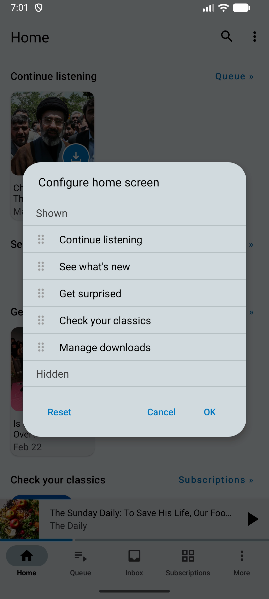
- 标题 "Configure home screen"
- 可拖拽排序的分区列表（Shown / Hidden 两组）：
  - Continue listening / See what's new / Get surprised / Check your classics / Manage downloads
- 底部按钮：Reset / Cancel / OK

---

## 2. Queue 播放队列

### 2.1 Queue 页

- 标题 "Queue"，显示剧集数和剩余时长（如 "1 episode · Time left: 33 minutes"）
- 列表项：封面 + 日期 + 文件大小 + 标题 + 时长
- 左侧拖拽手柄（六点图标）用于排序
- 右侧下载按钮

### 2.2 Queue 页（多剧集）
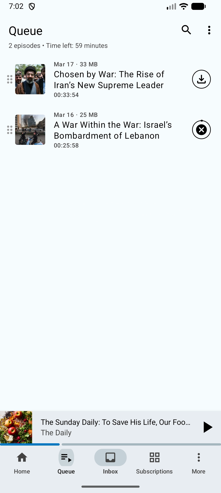
- 同上，显示 2 个剧集（"2 episodes · Time left: 59 minutes"）
- 第二个剧集正在下载（显示取消下载图标）

### 2.3 Queue 页 — 溢出菜单
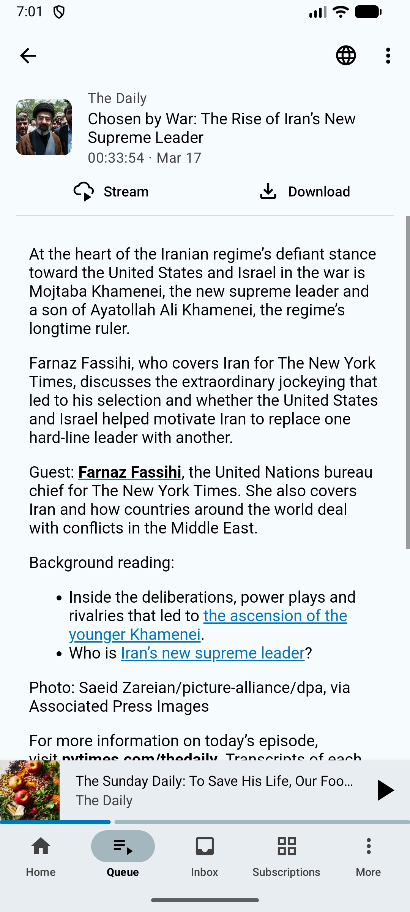
- 菜单项：Sort / Clear queue / Refresh / Lock queue（带 checkbox）

---

## 3. Inbox 收件箱

### 3.1 Inbox 页（空状态）
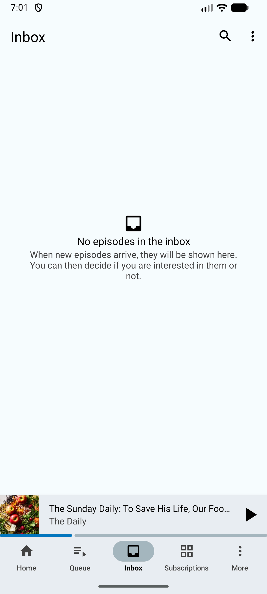
- 居中空状态图标 + 文字：
  - "No episodes in the inbox"
  - "When new episodes arrive, they will be shown here. You can then decide if you are interested in them or not."

### 3.2 Inbox 页 — 溢出菜单
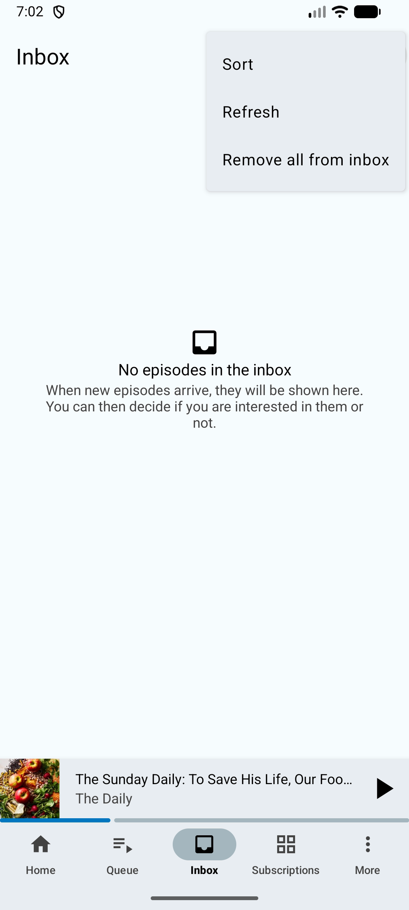
- 菜单项：Sort / Refresh / Remove all from inbox

---

## 4. Subscriptions 订阅管理

### 4.1 Subscriptions 页
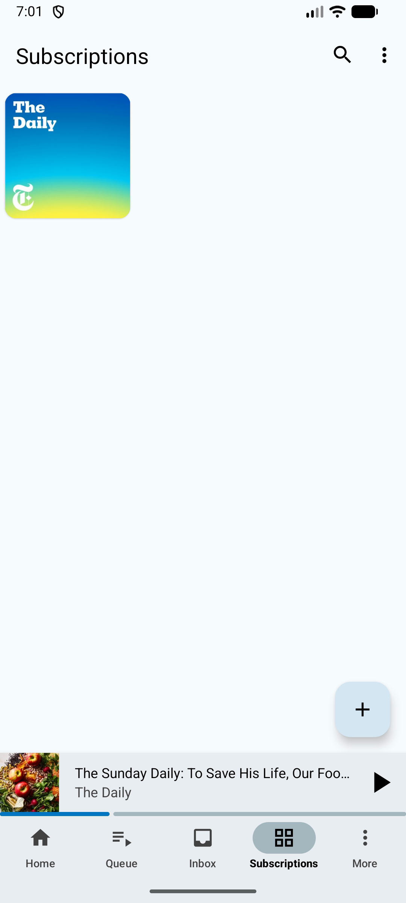
- 网格布局显示已订阅的播客封面
- 右下角 FAB 浮动按钮 "+" 用于添加新播客

### 4.2 Subscriptions 页 — 溢出菜单
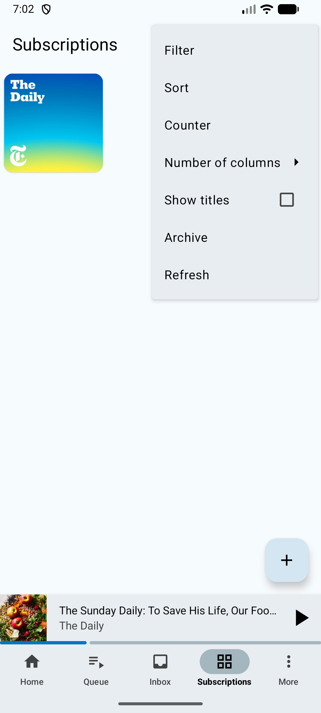
- 菜单项：Filter / Sort / Counter / Number of columns（子菜单） / Show titles（checkbox） / Archive / Refresh

---

## 5. Episode 剧集详情

### 5.1 Episode 详情页
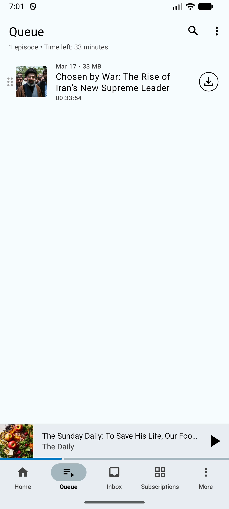
- 顶部：播客封面 + 播客名 + 剧集标题 + 时长 + 日期
- 操作按钮：Stream（在线播放） / Download（下载）
- 下方为剧集描述（富文本，含链接）
- 右上角：地球图标（网页链接）+ 三点菜单

### 5.2 Episode 详情 — 溢出菜单
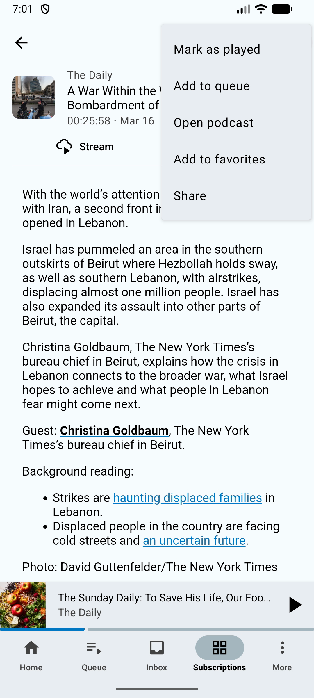
- 菜单项：Mark as played / Add to queue / Open podcast / Add to favorites / Share

### 5.3 Episode 详情 — 下载中

- Download 按钮变为 "Cancel download"（带进度圈）

---

## 6. Podcast Feed 播客订阅源

### 6.1 播客订阅源页
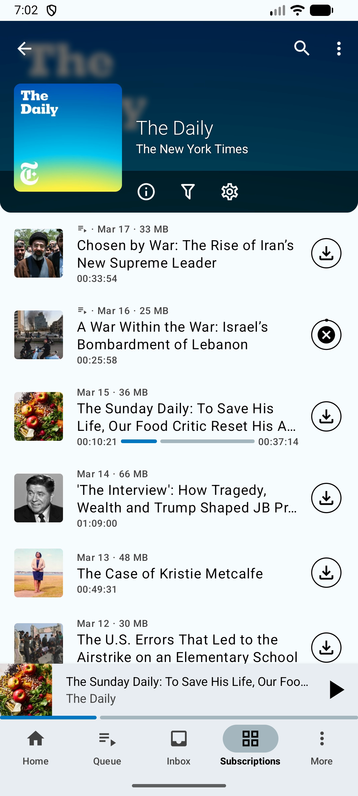
- 顶部大图横幅：播客封面 + 播客名 + 出品方
- 工具栏图标：info (i) / filter (漏斗) / settings (齿轮)
- 剧集列表：日期 + 文件大小 + 标题 + 时长
- 正在播放的剧集显示播放进度条（蓝色）
- 右侧下载按钮

---

## 7. More 更多功能

### 7.1 More 底部弹出菜单
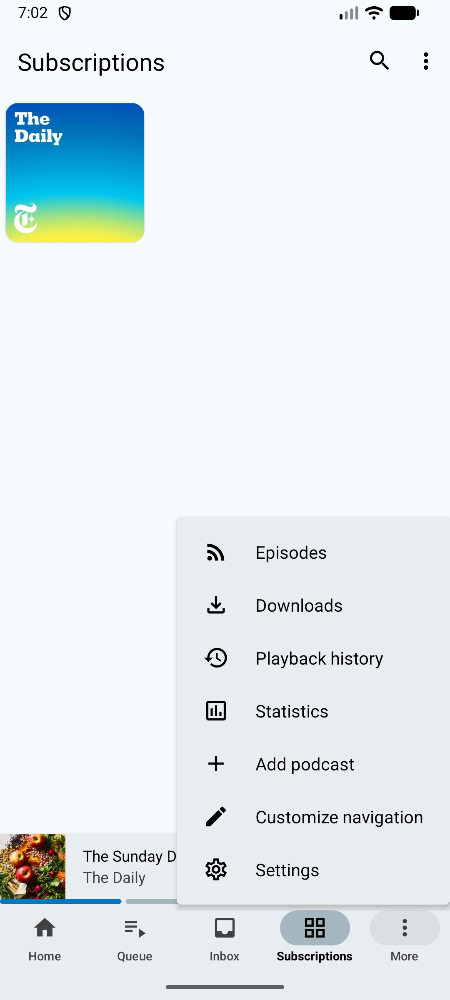
- 功能列表（带图标）：
  - Episodes（RSS 图标）
  - Downloads（下载图标）
  - Playback history（历史图标）
  - Statistics（统计图标）
  - Add podcast（+ 图标）
  - Customize navigation（编辑图标）
  - Settings（齿轮图标）

---

## 8. Episodes 全部剧集

### 8.1 Episodes 页
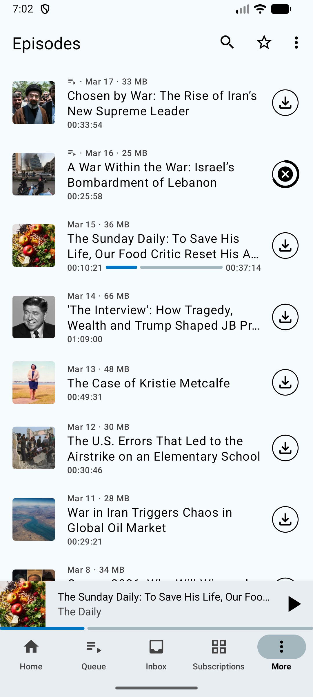
- 标题 "Episodes"，工具栏：搜索 + 收藏星标 + 三点菜单
- 所有订阅源的剧集按时间倒序排列
- 列表项同 Queue：封面 + 日期 + 大小 + 标题 + 时长
- 正在播放的剧集显示进度条
- 右侧下载按钮

---

## 9. Downloads 下载管理

### 9.1 Downloads 页
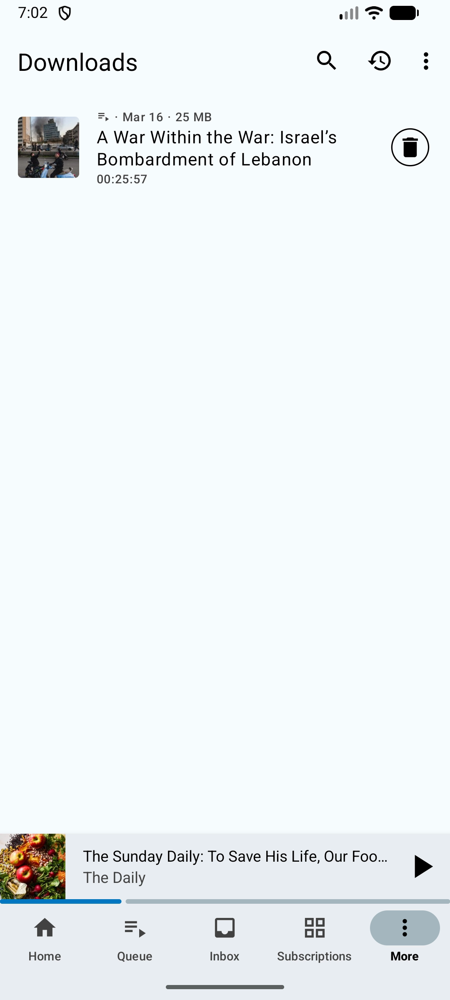
- 标题 "Downloads"，工具栏：搜索 + 历史图标 + 三点菜单
- 已下载剧集列表
- 右侧删除按钮（垃圾桶图标）

---

## 10. Statistics 统计

### 10.1 Statistics 页
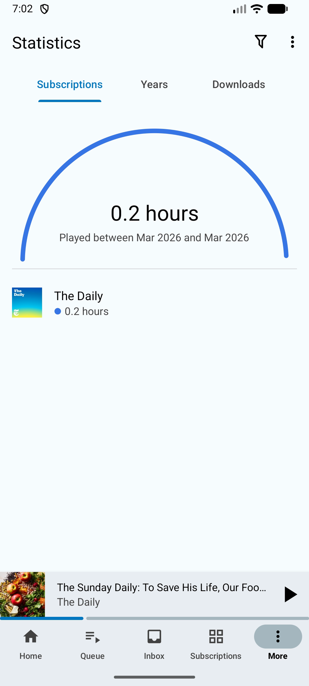
- 三个标签页：Subscriptions / Years / Downloads
- 半圆环图表显示总播放时长（如 "0.2 hours"）
- 时间范围说明（如 "Played between Mar 2026 and Mar 2026"）
- 下方按播客分组显示各自播放时长
- 右上角筛选图标

---

## 11. Settings 设置

### 11.1 Settings 页
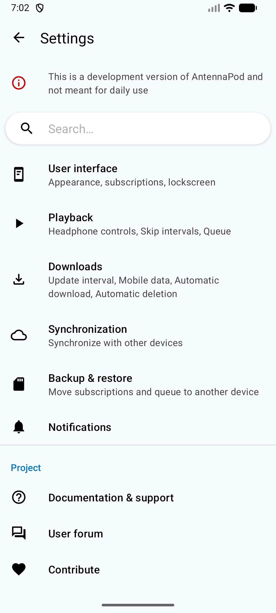
- 顶部开发版提示："This is a development version of AntennaPod and not meant for daily use"
- 搜索框
- 设置分组：
  - **User interface** — Appearance, subscriptions, lockscreen
  - **Playback** — Headphone controls, Skip intervals, Queue
  - **Downloads** — Update interval, Mobile data, Automatic download, Automatic deletion
  - **Synchronization** — Synchronize with other devices
  - **Backup & restore** — Move subscriptions and queue to another device
  - **Notifications**
- Project 分组：
  - Documentation & support / User forum / Contribute / Report bug / About

---

## 12. Drawer Preferences 导航自定义

### 12.1 导航自定义弹窗
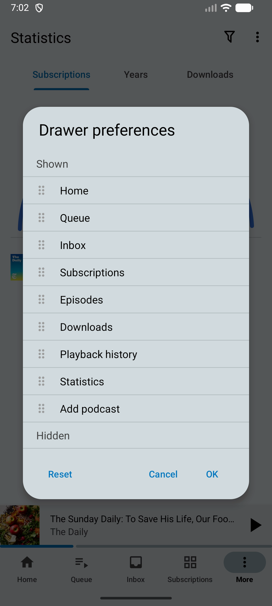
- 标题 "Drawer preferences"
- 可拖拽排序的导航项（Shown / Hidden 两组）：
  - Home / Queue / Inbox / Subscriptions / Episodes / Downloads / Playback history / Statistics / Add podcast
- 底部按钮：Reset / Cancel / OK

---

## 通用 UI 元素

| 元素 | 说明 |
|------|------|
| **底部导航栏** | 5 个 Tab：Home / Queue / Inbox / Subscriptions / More |
| **迷你播放器** | 位于底部导航栏上方，显示当前播放节目封面、标题、播客名、播放按钮 |
| **工具栏** | 左侧返回箭头（二级页面）/ 标题；右侧搜索、三点菜单 |
| **溢出菜单** | 右上角三点菜单弹出，各页面菜单项不同 |
| **剧集列表项** | 封面缩略图 + 日期 + 文件大小 + 标题 + 时长 + 右侧操作按钮 |
| **空状态** | 居中图标 + 说明文字（Inbox 等页面无内容时显示） |
| **FAB 浮动按钮** | Subscriptions 页右下角 "+" 添加播客 |
